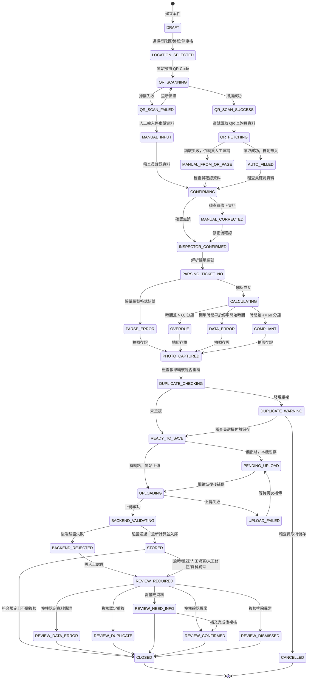
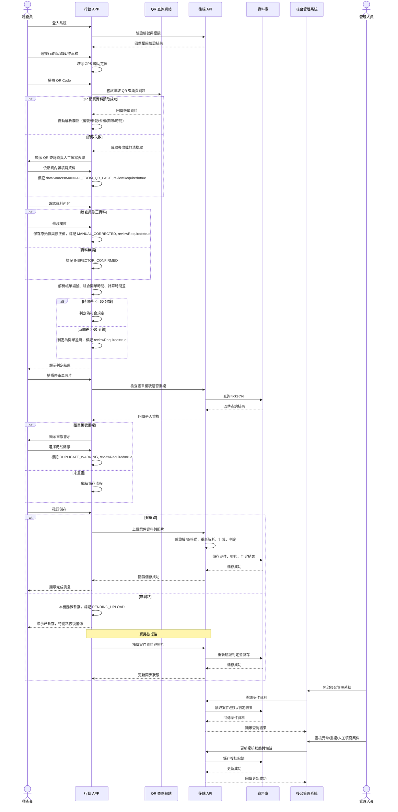

# 停車單稽查系統（IT-Smart Parking Recheck）

停車單稽查系統協助稽查員在現場對違規停車開立的紙本停車單進行複查，透過行動 APP 掃描停車單上的 QR Code（或人工輸入）建立稽查案件，由系統自動判定開單是否逾時、是否重複，並將案件上傳後端存查；管理人員再於後台對有疑義的案件進行複核、統計與報表匯出。

> 本文件依據既有的活動圖、循序圖、狀態圖與使用案例圖整理而成，作為系統規格依據。專案目前已有一份可執行的原型（後端 FastAPI + SQLite、稽查員 APP 與後台管理系統兩個前端），實作細節、與本規格的對應及已知簡化請見 [`prototype/README.md`](prototype/README.md)。

## 目錄

- [系統角色](#系統角色)
- [系統組成](#系統組成)
- [核心稽查流程](#核心稽查流程)
- [關鍵判定規則](#關鍵判定規則)
- [案件狀態機](#案件狀態機)
- [系統互動循序](#系統互動循序)
- [使用案例](#使用案例)
- [離線與補傳機制](#離線與補傳機制)
- [專案現況](#專案現況)

## 系統角色

| 角色 | 說明 |
| --- | --- |
| 稽查員 | 現場人員，使用行動 APP 建立、確認並儲存稽查案件 |
| 系統管理員 | 管理帳號權限、判定規則、路段資料與系統參數 |
| 管理人員 | 於後台查詢、複核異常／重複／人工填寫案件，並匯出統計報表 |

## 系統組成

| 元件 | 角色 |
| --- | --- |
| 行動 APP | 稽查員現場操作介面，負責掃描 QR Code、蒐集資料、離線暫存、上傳案件 |
| QR 查詢網站 | 停車單 QR Code 指向的外部查詢頁，提供帳單編號、車號、金額、停車時間等原始資料 |
| 後端 API | 驗證權限、重新解析與計算、檢查重複、寫入資料庫、供後台管理系統查詢 |
| 資料庫 | 儲存案件、照片與判定結果 |
| 後台管理系統 | 管理人員查詢與複核案件、更新複核狀態的介面 |

## 核心稽查流程

1. **登入與權限檢查**：稽查員登入 APP，系統檢查帳號權限、相機、定位、網路狀態；無稽查權限則顯示無權限訊息並中止。
2. **選擇稽查地點**：稽查員選擇行政區、路段、停車格，APP 取得 GPS 作為輔助定位。
3. **取得停車單資料**：稽查員掃描停車單 QR Code。
   - 掃描失敗 → 提示重新掃描或人工輸入 → 標記 `dataSource = MANUAL_FROM_TICKET`，標記需後台複核。
   - 掃描成功 → APP 嘗試讀取 QR 查詢頁資料：
     - 讀取成功 → 自動帶入帳單編號、車號、金額、繳費期限、停車日期、停車開始／結束時間 → 標記 `dataSource = AUTO_QR`。
     - 讀取失敗 → 開啟 QR 查詢頁供稽查員現場依頁面內容填寫 → 標記 `dataSource = MANUAL_FROM_QR_PAGE`，標記需後台複核。
4. **稽查員確認資料**：確認內容是否需要修正。
   - 需修正 → 手動修正欄位，系統同時保存原始值與修正值 → 標記 `MANUAL_CORRECTED`，標記需後台複核。
   - 無誤 → 標記 `INSPECTOR_CONFIRMED`。
5. **開單時效判定**：系統解析帳單編號、組合開單時間，計算「開單時間－停車開始時間」的時間差。
   - 時間差 ≤ 60 分鐘 → 判定符合規定。
   - 時間差 > 60 分鐘 → 判定開單逾時 → 標記需後台複核。
6. **拍照存證**：稽查員拍攝停車單照片作為佐證。
7. **重複檢查**：系統檢查帳單編號是否重複。
   - 重複 → 跳出重複警示 → 標記 `DUPLICATE_WARNING`，標記需後台複核。
   - 未重複 → 繼續流程。
8. **儲存與上傳**：稽查員確認儲存。
   - 有網路 → 即時上傳後端。
   - 無網路 → 本機暫存，標記 `PENDING_UPLOAD`，待網路恢復後自動補傳。
9. **後端覆核與入庫**：後端重新驗證資料、重新解析帳單編號、重新計算時間差、重新檢查重複案件，將資料與照片存入資料庫。
   - 需後台複核 → 案件進入待複核清單。
   - 不需複核 → 案件完成入庫。
10. **後台管理**：管理人員複核查詢、複核、統計與匯出報表。

## 關鍵判定規則

**帳單編號解析**（範例 `Q7028435D095253`）

| 區段 | 值 | 意義 |
| --- | --- | --- |
| `Q702` | 7/02 | 日期（月日） |
| `8435D` | — | 開單員編號 |
| `095253` | 09:52:53 | 開單時間（時分秒） |

開單時間由「停車日期取年份」＋「帳單編號取月日」＋「帳單編號取時分秒」組合而成。

**開單逾時判定**：時間差 = 開單時間－停車開始時間；時間差 ≤ 60 分鐘視為符合規定，超過則判定為開單逾時，並標記需後台複核。若開單時間早於停車開始時間，視為資料異常（`DATA_ERROR`）。

**資料來源標記（dataSource）**

| 值 | 觸發情境 |
| --- | --- |
| `AUTO_QR` | QR 查詢頁資料讀取成功，自動帶入 |
| `MANUAL_FROM_QR_PAGE` | QR 查詢頁讀取失敗，依網頁內容人工填寫 |
| `MANUAL_FROM_TICKET` | QR Code 掃描失敗，直接人工輸入紙本資料 |
| `MANUAL_CORRECTED` | 稽查員對已帶入的資料手動修正（同時保留原始值） |

**需後台複核（reviewRequired）觸發條件**：人工輸入／人工填寫、資料經手動修正、開單逾時、帳單編號重複。符合規定且無上述情形的案件可直接入庫結案，無需複核。

## 案件狀態機

案件從建立到結案的完整生命週期：



## 系統互動循序

以下摘要各元件間的主要呼叫順序（完整分支詳見核心稽查流程說明）：



## 使用案例

**稽查員**
- 登入系統
- 選擇稽查地點
- 掃描 QR Code（包含讀取 QR 查詢頁資料；讀取失敗時可延伸為人工填寫帳單資料）
- 確認資料內容（包含解析帳單編號、計算開單時間差、判定是否開單逾時；資料有誤時可延伸為修正資料欄位）
- 拍攝停車單照片
- 儲存稽查案件（包含檢查重複帳單；無網路時可延伸為離線暫存與補傳）

**系統管理員**
- 管理帳號權限
- 設定判定規則
- 管理路段資料
- 管理系統參數

**管理人員**
- 查看統計資料
- 匯出報表
- 複核異常案件 / 複核重複案件 / 複核人工填寫案件（皆包含更新複核狀態）
- 查詢稽查案件（包含查看案件明細）

## 離線與補傳機制

行動 APP 在無網路狀態下仍可完成整個稽查流程：案件於本機暫存並標記 `PENDING_UPLOAD`，待裝置偵測到網路恢復後自動補傳至後端 API；後端會重新驗證並重新判定一次（重新解析帳單編號、重新計算時間差、重新檢查重複），確保離線期間累積的案件在入庫前仍符合最新規則。

## 專案現況

除本設計文件外，`prototype/` 目錄下已有一份可執行的原型，涵蓋稽查員 APP、後台管理系統（管理人員與系統管理員已分權為兩組登入）與共用的後端（FastAPI + SQLAlchemy，本機用 SQLite、部署用 PostgreSQL），並可用 Docker 一鍵啟動。原型優先驗證本文件的核心流程、狀態機與判定規則，並已陸續補上生產強化：bcrypt 密碼、JWT 與端點角色分權、CORS 白名單、Alembic 遷移、QR 查詢網站的真實抓取＋解析（含 SSRF 防護）、真實 GPS 定位擷取與存查，以及 59 個 `pytest` 測試與 CI。剩餘的刻意簡化（例如離線偵測）與原因說明見 [`prototype/README.md`](prototype/README.md) 的「與狀態圖／範圍的簡化說明」章節。

## 專案結構與生產部署管線

倉庫在根目錄以一支管線 `pipeline.sh` 把「開發原型」與「生產部署」分開：

| 目錄 | 角色 |
| --- | --- |
| `prototype/` | 單一開發來源（含 `prototype/dev.sh` 開發 CLI，見其 README） |
| `production/` | 由原型**晉級**而來、可部署的複本（由 `update-production` 產生／更新） |
| `deploy/` | 生產用 `docker-compose.prod.yml` 與 `.env.production`（機密，git 忽略） |

**生產與原型的差異（由 `deploy/docker-compose.prod.yml` 強制）**：`APP_ENV=production`（弱／預設 `JWT_SECRET` 直接拒絕啟動）、`SEED_DEMO_DATA=false`（不建立任何示範帳號）、`QR_DEMO_MODE=false` 與 `QR_MOCK_SITE_ENABLED=false`（關閉示範 QR 與模擬查詢站）、後端**不對外開埠**（僅由前端 nginx 反向代理），機密一律由 `deploy/.env.production` 注入且缺漏即拒絕啟動。

### 常用指令（`./pipeline.sh <cmd>`，或 `make <target>`）

```bash
cp deploy/.env.production.example deploy/.env.production   # 填入 REQUIRED 值
./pipeline.sh doctor              # 檢查 Docker、production/、.env.production
./pipeline.sh update-production   # 晉級 prototype/ → production/（先跑測試把關）
./pipeline.sh build-production    # 建置帶版號（git SHA）的映像
./pipeline.sh deploy              # 啟動生產堆疊並健康檢查
./pipeline.sh create-admin <帳號> # 生產無示範帳號 → 建立第一個真實管理員
```

其他：`diff`（預覽晉級變更）、`release`（晉級→建置→部署一次到位）、`migrate`、`status`、`logs`、`verify`、`config`、`rollback <tag>`、`down`。完整清單見 `./pipeline.sh --help`。

> 晉級流程：修改一律在 `prototype/` 進行並驗證，`update-production` 會先跑後端測試通過才把程式碼同步進 `production/`（排除 `.venv`、`node_modules`、資料庫、`manual/`、開發用 `dev.sh` 等），並寫入 `production/PROMOTION.txt` 記錄來源 commit 與時間，供審閱後提交。
