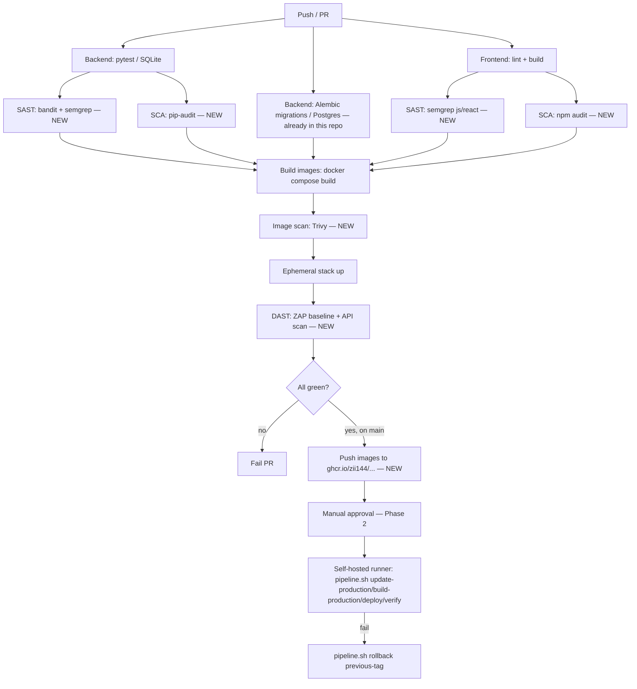

# DevOps & CI/CD Plan — IT-Smart Parking Recheck (this repo)

**Status update (2026-07-30): most of this plan is now implemented, not just proposed — see
`IMPLEMENTATION_LOG.md` for the full account of what actually happened and why, this file
still describes the original reasoning/tradeoffs but its per-item status is corrected inline
below.** Done: self-hosted runner + CD (`deploy.yml`, manual-dispatch + rollback-on-failure),
Trivy image scan + GHCR publish in CI, nginx `server_tokens off` + CSP, compose log rotation,
nightly backup cron, and observability (a dedicated `parking-monitoring` Uptime Kuma instance,
not the host's pre-existing container — see §1 row correction — now upgraded to 2.x). Still
genuinely open: SAST/SCA/DAST CI gates, non-root backend Dockerfile user, a real restore drill
from the backup (file-size matching only so far), and Phase 5 IaC (not started, optional).
Consolidates the sandbox's validated pipeline design (`sandbox-it-smart-parking-recheck/devops_plan.md`)
with this repo's *actual* current state and the host/network findings already recorded in
`proposed_provisioning.md` / `proposed_network_diag.md`. Every gap below was confirmed by direct
inspection of this repo, the sandbox repo, and the live host on 2026-07-23 — nothing here is
inherited unchecked from the sandbox.

---

## 0. What's different from the sandbox's plan (read this first)

The sandbox's `devops_plan.md` was written against an assumption — a *dedicated* host, TimeCard
moved off elsewhere — that does not hold for this repo. Confirmed 2026-07-23 by direct
`virsh`/`docker ps`/`microk8s kubectl` inspection of the actual host (`iactor`, the Dell `.247`/`.248`
box):

- **This app's VM will share the hypervisor** with two existing libvirt VMs (`devops-test`,
  `deltapath-uc` — 8 vCPU/32 GB already committed) and an active Docker workload (monitoring stack,
  `qdrant`, `waha`, `adguardhome`, `zs-office-*`, plus **`uptime-kuma`**, already running). TimeCard is
  not among them — it fully migrated off this host, contrary to the sandbox plan's premise.
- Host capacity re-verified today: **16 threads (8c/16t) Xeon 6369P, 125 GB RAM (41 GB currently
  free), `vm-pool` at 9.09 TiB / 8.70 TiB free.** Storage is not a constraint; CPU/RAM headroom is
  the real limit given existing residents.
- The network/host placement decisions (VLAN 30 DMZ, edge proxy, VM sizing, hypervisor hardening)
  are **already fully worked out and confirmed** in `proposed_provisioning.md` / `proposed_network_diag.md`
  — this document does not repeat that reasoning, it defers to it and only adds the CI/CD layer on top.
- Everything else below (orchestration choice, CI/CD tooling, security gates, observability,
  backup/DR) still holds — those decisions were about the *app*, not the host, and are host-agnostic.

**Alternative host considered and rejected (2026-07-23): `.215`.** `.215` (192.168.1.215) is a
Windows Server 2012 R2 box running VMware, currently hosting 2 Windows VMs + 1 Ubuntu VM; one
Windows VM's resources were offered as capacity for this project's VM. Declined —
**confirmed reachable**: TCP 445 (SMB), 80, 3389 (RDP, confirmed temporary), 5985 (WinRM) all open;
ICMP filtered. **Confirmed by the user:** the host OS itself is staying as-is with no
patch/ESU/replacement plan — Windows Server 2012 R2 has been past Microsoft Extended Support (and
therefore unpatched, ESU aside) since 2023-10-10. RDP is being closed, leaving only SMB open, but
that only trims the *current* exposed-service list — it doesn't restore vendor security patching
for the host OS or hypervisor layer itself, which is the actual risk driver for any new guest VM
placed there (a host-level/hypervisor compromise bypasses guest-level hardening entirely). A
middle option — using `.215`'s freed capacity for the LAN-only `prototype/` environment instead of
production — was also raised and **declined by the user: no prototype VM/environment is being
provisioned for this project.** Final decision: **everything for this project stays on `.247`
only.** `.215` plays no role here.

---

## 1. Current state of *this* repo (verified 2026-07-23, not assumed from the sandbox)

| Area | This repo | Sandbox | Gap |
|---|---|---|---|
| CI file | `.github/workflows/ci.yml` exists | exists | — |
| Backend tests | pytest (SQLite) **+ a real Postgres/Alembic migration job** (upgrade→downgrade→upgrade) | pytest only, no migration job | **This repo is ahead here** — keep it, don't drop it when merging in the sandbox's gates |
| SAST | none | bandit + semgrep (backend), semgrep (frontend) | Still missing — not scoped into the 2026-07-27/30 CI work, add |
| SCA | none | pip-audit, npm audit | Still missing — add |
| Image scan | **DONE (2026-07-27)** — `image-scan` job (Trivy) on both built images, `.github/workflows/ci.yml` | Trivy on both built images | Closed. First real run found 2 HIGH CVEs (backend: stale pip/setuptools/wheel) + 37 CVEs (frontend: `nginx:1.27-alpine` bundled packages) — both fixed, `nginx` base bumped to `1.30-alpine` |
| DAST | none | ZAP baseline (frontend) + ZAP API scan (backend OpenAPI) | Still missing — add |
| Registry/publish job | **DONE (2026-07-27)** — `publish` job, `.github/workflows/ci.yml`, pushes to `ghcr.io/zii144/...` | GHCR push on `main`, tag = git SHA | Closed |
| `pipeline.sh` deploy/rollback mechanics | **CLOSED 2026-07-23** — ported verbatim from the sandbox, `diff` now reports the two files identical | `cmd_pull_production <tag>` (pulls + retags CI-published `ghcr.io/$GHCR_OWNER/parking-{backend,frontend}:<tag>` instead of rebuilding on the VM); `deploy --pull` uses it; every `deploy`/`rollback` that passes `cmd_verify` writes the tag to `deploy/.last-good-tag`; `rollback` with no argument defaults to that file; rsync/build/migrate/compose-up failures now `die` with an actionable message | Done — this repo's `pipeline.sh` now has the mechanism the CD design in §3/§4 depends on (pull the Trivy/ZAP-scanned GHCR image rather than rebuild from source on the deploy runner; `rollback` defaults to last-known-good). **Still outstanding:** `GHCR_OWNER` is not yet documented in either repo's `deploy/.env.production.example` — add it here before Phase 2's `deploy.yml` relies on `--pull`. |
| Backend Dockerfile | runs as **root**; pip/setuptools/wheel upgrade **done** (2026-07-27, Trivy-driven) | non-root `USER app`, pip/setuptools/wheel upgraded before install | Still missing the non-root `USER app` half — the packaging-tooling CVE fix landed via the Trivy job but didn't include this |
| Frontend `nginx.conf` | **DONE** — `server_tokens off` + CSP live with CARTO allow-list, `production/frontend/nginx.conf` | `server_tokens off`, CSP live (allow-lists CARTO basemap CDN for the admin 3D map) | Closed |
| `deploy/docker-compose.prod.yml` log rotation | **DONE** — `json-file`, `max-size: 10m`, `max-file: 5` on all four services | `json-file`, `max-size: 10m`, `max-file: 5` on all three services | Closed |
| Uptime monitoring | **DONE, but not the way this row originally proposed** — a dedicated standalone `parking-monitoring` Kuma instance was deployed instead (`deploy/monitoring/docker-compose.yml`, ported into git 2026-07-27, PR #47), publishing `:3001` directly, **not** reusing the host's pre-existing (unpublished) `uptime-kuma` container. 5 monitors configured and healthy: app health, db, backend, edge-proxy, frontend. Upgraded 1.23.17 → 2.4.0 on 2026-07-30, before go-live, to eat the one-way DB migration while there was no real monitoring history at stake — see `IMPLEMENTATION_LOG.md` §9. | Uptime Kuma added to the plan | Closed — reasoning for the standalone-instance-over-reuse call isn't recorded in this doc, only in the log; the two host `uptime-kuma` instances (this project's dedicated one and the original host-level one) remain intentionally separate |
| Self-hosted runner | **DONE** — installed on `parking-recheck`, `deploy.yml` `runs-on: [self-hosted, parking-prod]`, `workflow_dispatch` trigger (the "approval click") + rollback-on-failure | design only, not yet installed either | Closed |
| `pipeline.sh` | one command (`pull-production`?) missing vs. sandbox's | has `cmd_pull_production` | Minor — confirm whether this repo needs that command before wiring CD; not a blocker either way |

**Everything in the table above was confirmed by diffing the two repos directly** (`.github/workflows/ci.yml`,
`prototype/backend/Dockerfile`, `production/backend/Dockerfile`, `production/frontend/nginx.conf`,
`deploy/docker-compose.prod.yml`, `pipeline.sh`) — not carried over from the sandbox's own notes about itself.

---

## 2. Decisions carried forward unchanged from the sandbox plan (do not re-open)

Host-agnostic decisions validated in the sandbox session — nothing about the shared-host reality
in §0 changes these:

| Decision | Choice | Why |
|---|---|---|
| Orchestration | **Docker Compose**, not k3s/k8s | One VM, 3 services, no multi-node scaling need. Revisit only per the explicit triggers in the sandbox plan §3 (second app sharing infra, real multi-VM/HA requirement, measured need for backend autoscaling) |
| CI | GitHub Actions | Already the org's platform |
| CD transport | Self-hosted Actions runner on the target VM | No inbound SSH from GitHub's cloud needs opening on a DMZ-facing box |
| Registry | GHCR, audit trail not primary deploy path | Free with existing GitHub org |
| SAST/SCA/image scan/DAST tooling | bandit+semgrep / pip-audit+npm audit / Trivy / ZAP baseline+API | Validated clean against this exact app family in the sandbox session |
| Secrets (CI) | GitHub Actions encrypted secrets | Standard |
| Secrets (runtime) | `deploy/.env.production`, root-owned, `chmod 600` | Matches app's existing fail-fast pattern |
| Logs | Docker `json-file` + rotation, no shipper yet | Right-sized for one app/one VM |
| Backups | `pg_dump` cron + `restic` off-box | Nothing today ships DB/photo data off-box; disk failure = data loss currently |
| IaC | Ansible (optional, Phase 5) | Not urgent for one VM, worth codifying once it's stable |

---

## 3. Reconciled CI pipeline for this repo

Keep this repo's existing Postgres/Alembic migration job (its own value, sandbox doesn't have it) and
layer the sandbox's security gates on top, rather than replacing one CI design with the other:

**Concurrency note:** this repo's `ci.yml` already has `concurrency: group: ci-${{ github.ref }},
cancel-in-progress: true` — the sandbox's doesn't. Keep it when merging; it's a strict improvement
(saves CI minutes, no functional loss).

---

## 4. Rollout phases (adjusted for what's already done)

| Phase | Contents | Status |
|---|---|---|
| **0. Dockerization hardening** | Backend Dockerfile non-root user; frontend `server_tokens off` + CSP; log rotation | **Partially done** — CSP/`server_tokens`/log rotation closed; non-root backend `USER` still open |
| **1. CI security gates** | SAST/SCA/Trivy/DAST jobs; GHCR publish | **Partially done** — Trivy + GHCR publish closed (2026-07-27); SAST/SCA/DAST still open |
| **2. Self-hosted runner + CD** | Runner install, `deploy.yml` with approval gate + rollback, `pipeline.sh --pull` mechanism | **Done (2026-07-27)** — real CD cutover verified with a live `Deploy` dispatch that rebuilt the running containers from the target commit |
| **3. Observability** | Uptime monitoring for the app | **Done (2026-07-27, upgraded 2026-07-30)** — dedicated `parking-monitoring` Kuma instance, 5 monitors, now on 2.4.0 |
| **4. Backup & DR** | `pg_dump` + uploads-tarball cron, retention, restore test | **Partially done** — nightly cron confirmed running and logging OK (PR #47); a real restore drill (not just file-size matching) is still open, tracked in `IMPLEMENTATION_LOG.md` §8 |
| **5. (Optional) IaC** | Ansible playbook for VM bootstrap | Not started |

Remaining core work: SAST/SCA/DAST CI gates, non-root backend Dockerfile, and one real restore
drill. Phase 5 stays optional.

---

## 5. Open items (assessment only — needs a decision or access before proceeding)

Carried over from `proposed_provisioning.md`, still unresolved as of 2026-07-23:

- **Unprivileged QEMU check** — whether `/etc/libvirt/qemu.conf` runs guests as the non-root `qemu`
  user. Re-attempted today via `sudo -n` (non-interactive): still fails, needs an interactive sudo
  session. Confirm before go-live.
- **Storage/KSM isolation for the new VM** — not yet decided whether its disk gets its own
  dataset/volume within `vm-pool` or shares the pool with the existing two VMs, and whether KSM
  gets disabled host-wide or just for this VM.
- ~~**`uptime-kuma` UI reachability**~~ — **resolved**, moot: this project ended up with its own
  dedicated, directly-published (`:3001`) Kuma instance instead of reusing the host's unpublished
  one, so the original reachability question no longer applies.
- ~~**Admin frontend CARTO/map dependency**~~ — **resolved**: `production/frontend/nginx.conf` has
  the CARTO allow-list live in its CSP.
- ~~**CI merge decision**~~ — **resolved**: `backend-migrations` (Alembic) stayed a separate job
  from `backend-tests`, `frontend`, `image-scan`, and `publish` in `.github/workflows/ci.yml`.

Nothing above blocks continuing the assessment; they're flagged as pre-implementation checks.

---

## 6. Explicitly out of scope for this document

- Any application code changes (only Dockerfile/nginx.conf/CI YAML/compose-file config are touched
  by this plan, per the sandbox's own scoping).
- Re-litigating host/network placement — see `proposed_provisioning.md` and
  `proposed_network_diag.md` for that, already confirmed 2026-07-23.
- Implementation of any kind. Per current instructions, this repo gets **plan and assessment only**
  until implementation is explicitly requested.
